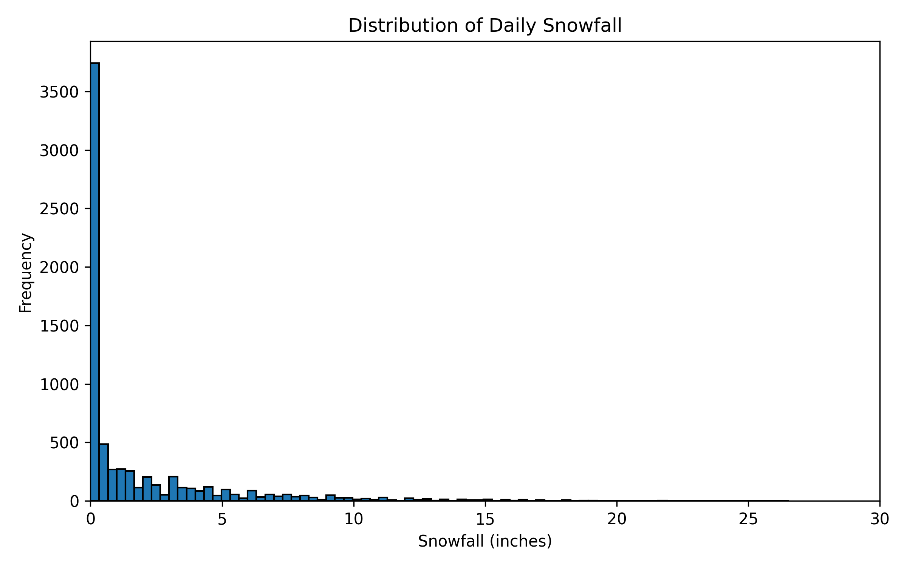
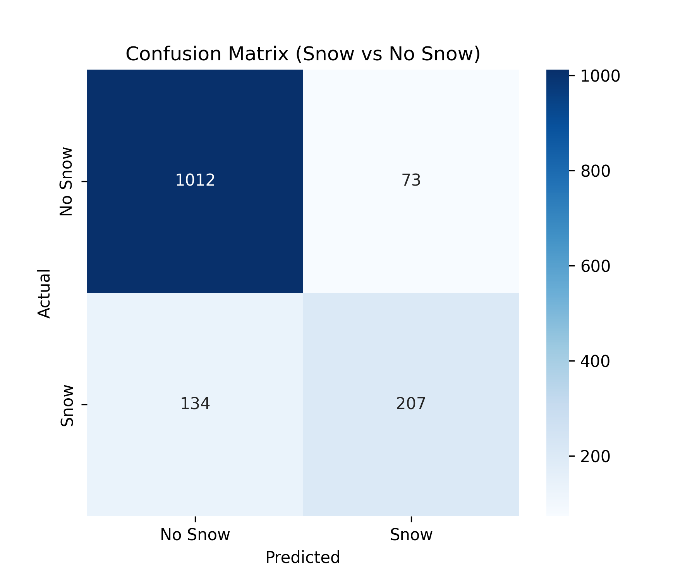
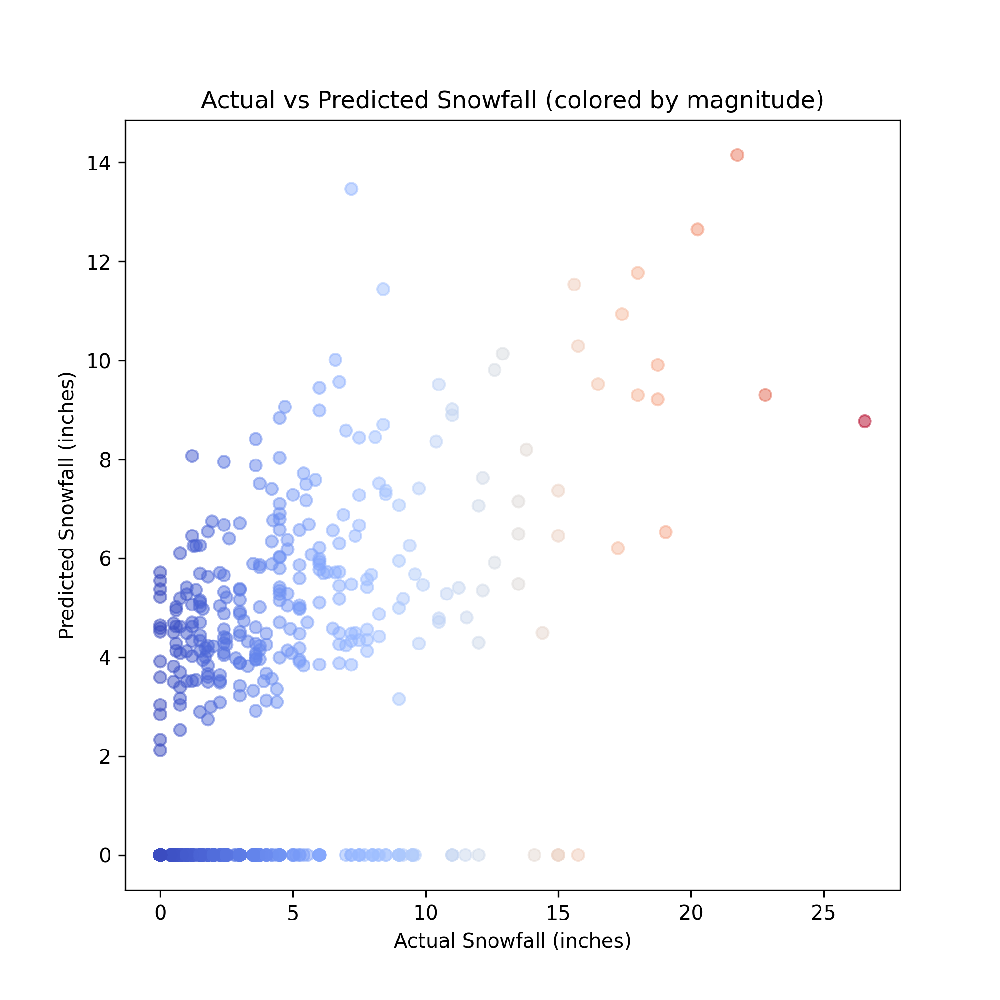
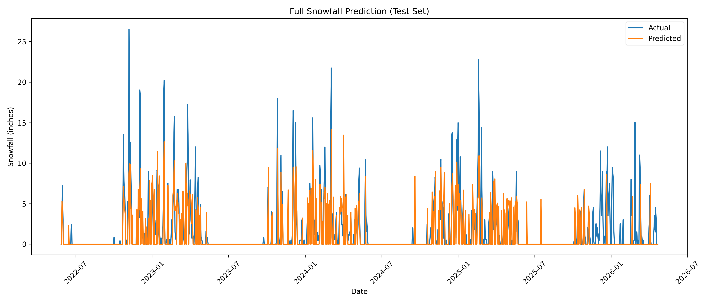

# Probabilistic Snowfall Forecasting

Machine learning project for forecasting snowfall occurrence and accumulation at ski resorts using historical SNOTEL weather data.

## Overview

This project predicts:
1. Whether snowfall will occur tomorrow
2. How much snowfall will occur if it snows

The forecasting system uses a two-stage XGBoost architecture:
- Stage 1: Snowfall occurrence classifier
- Stage 2: Conditional snowfall amount regressor

This split addresses the highly zero-inflated nature of daily snowfall, where most days
have no snow and a single regression model would be dominated by these zero/near-zero
observations.

## Dataset

- Source: [USDA SNOTEL](https://www.nrcs.usda.gov/resources/data-and-reports/snow-telemetry-data-network-snotel) weather station data
- Region: Grand Targhee, Wyoming
- Features:
  - Temperature
  - Precipitation
  - Snow depth
  - Snow water equivalent (SWE)

## Feature Engineering

Engineered 58 features including:
- Lag variables (1, 2, 3, 7, 14 days)
- Rolling-window statistics
- Seasonal cyclical encodings
- Freezing indicators
- Precipitation-temperature interaction features

## Models

### Baselines
- Linear Regression
- Random Forest

### Final Model
- XGBoost Classifier
- XGBoost Regressor

## Technologies

- Python
- Pandas
- NumPy
- XGBoost
- Scikit-learn
- Matplotlib
- Seaborn

## Results

| Model | RMSE (inches) | MAE (inches) |
|---------|---------|---------|
| Linear Regression | 2.27 | 1.37 |
| Random Forest | 2.26 | 1.25 |
| Two-Stage XGBoost | 2.45 | 1.17 |

Classifier Metrics:
- Accuracy: 85.5%
- Precision: 73.9%
- Recall: 60.7%
- F1 Score: 66.7%

## Visualizations






## Setup & Usage

```bash
pip install -r requirements.txt
python src/new_snowfall_xgb.py
```

Place `grand_targhee_snotel.csv` in `data/` before running. Plots are written to `figures/` and prediction results are written to `results/`.

## Limitations

- Trained on a single region (Grand Targhee); generalization to other locations untested
- Daily-resolution data only; doesn't capture intra-day weather shifts
- Extreme snowfall events remain underestimated (e.g., a 26-inch event was predicted at ~9 inches)

## Full Report

See [`Snowfall_Forecasting_Report.pdf`](Snowfall_Forecasting_Report.pdf) for the full writeup.

## Authors

Sebastian Teslic
Finn Ryan
Javier Martinez Alvarez